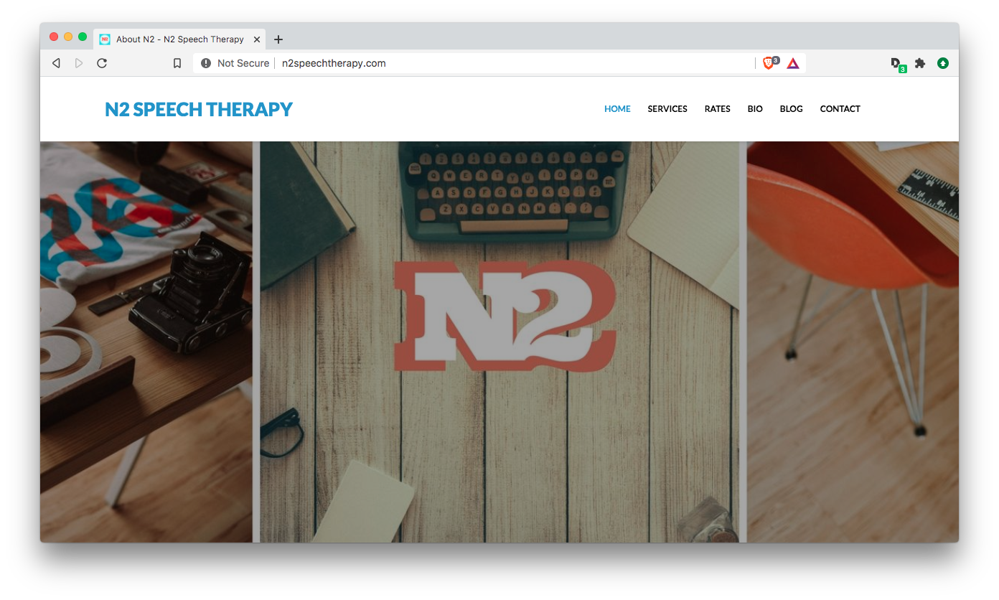

# Official website repo of N2 Speech Therapy

## Intro

A website build for Toronto speech therapy services provider N2 Speech Therapy. The project required the design and building of a public facing website for their private speech language therapy services business. Requirements included UI design with a clean professional layout, graphic design (logo creation, color palette development, banner and custom asset creation, photo sourcing), UX copywriting, as well as coding and development. As the client required a blog and the ability to update the site themselves, the site was built with Wordpress, HTML5, PHP, CSS3, and Javascript.